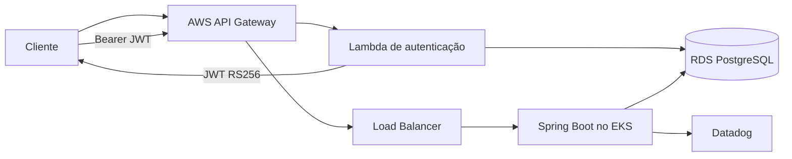

# Mecânica API - Tech Challenge Fase 3

Aplicação principal do sistema de ordens de serviço. Este é um dos quatro repositórios da Fase 3 e contém a API Spring Boot, sua imagem Docker, os manifests da aplicação no Kubernetes e seus pipelines de CI/CD.

## Responsabilidades

- Gerenciar clientes, veículos, peças, serviços, estoque e ordens de serviço.
- Validar os JWTs RS256 emitidos pela Lambda de autenticação.
- Executar migrations por Flyway.
- Publicar healthchecks, métricas Prometheus e logs JSON correlacionados.
- Executar no Amazon EKS com escalabilidade horizontal.

O PostgreSQL não é executado neste cluster. A aplicação utiliza Amazon RDS.

## Tecnologias

Java 21, Spring Boot 4, Spring Security, JWT RS256, JPA, PostgreSQL, Flyway, Swagger/OpenAPI, Actuator, Micrometer/Prometheus, Datadog, Docker, Kubernetes, HPA, Amazon ECR/EKS/RDS, GitHub Actions e JaCoCo.

## Arquitetura



Diagramas de componentes e sequências: [docs/architecture.md](docs/architecture.md).
Modelo ER e justificativa do PostgreSQL: [docs/relational-model.md](docs/relational-model.md).
Descoberta do domínio: [docs/domain](docs/domain/README.md). Decisões:
[docs/adr](docs/adr) e [docs/rfc](docs/rfc).

## Autenticação

A autenticação ocorre no API Gateway e na Lambda. A Lambda consulta CPF/CNPJ e devolve um JWT. A API valida assinatura RS256, emissor, expiração e role usando apenas a chave pública.

Na abertura de uma ordem, o cliente é identificado pelo UUID presente no `sub`
do JWT e informa somente a placa, a `matriculaOperador` responsável e os itens.
A matrícula é validada contra um operador ativo. Assim, uma pessoa autenticada
não consegue abrir uma ordem em nome de outro CPF/CNPJ apenas alterando o corpo.

```http
GET /ordens-servico
Authorization: Bearer <accessToken>
```

- [Swagger pelo API Gateway](https://3o3iqeu0b9.execute-api.us-east-1.amazonaws.com/swagger-ui/index.html)
- [OpenAPI JSON](https://3o3iqeu0b9.execute-api.us-east-1.amazonaws.com/v3/api-docs)
- [Coleção Postman incluindo `POST /auth`](docs/postman/mecanica-fase3.postman_collection.json)

O Swagger é gerado pela aplicação Spring e, por isso, não contém a rota
serverless `POST /auth`. A coleção Postman documenta e automatiza esse fluxo,
armazenando o token retornado apenas em uma variável local da coleção.

## Testes

```powershell
.\mvnw.cmd clean verify
```

Os testes usam H2 em memória. O comando também gera `target/site/jacoco/index.html` e exige ao menos 80% de cobertura. A última validação local executou 101 testes com sucesso.

## Execução local com Docker

O Compose mantém PostgreSQL local somente para desenvolvimento. Carregue a chave pública usada pela Lambda:

```powershell
$env:JWT_PUBLIC_KEY = Get-Content -Raw "C:\caminho\jwt-public.pem"
docker compose up --build
```

Endereços locais:

- API: `http://localhost:8080`
- Swagger: `http://localhost:8080/swagger-ui/index.html`
- Health: `http://localhost:8080/actuator/health`
- Métricas: `http://localhost:8080/actuator/prometheus`

Encerre com `docker compose down`.

## Configuração da aplicação

| Variável | Uso |
|---|---|
| `SPRING_DATASOURCE_URL` | URL JDBC do PostgreSQL. |
| `SPRING_DATASOURCE_USERNAME` | Usuário do banco. |
| `SPRING_DATASOURCE_PASSWORD` | Senha do banco. |
| `JWT_PUBLIC_KEY` | Chave pública RSA em PEM. |
| `JWT_ISSUER` | Emissor esperado, padrão `mecanica-auth`. |
| `APP_ENVIRONMENT` | Tag das métricas. |

Nenhum segredo real é versionado. O CD cria o Kubernetes Secret com os Secrets do GitHub.

## CI/CD

O workflow `Application CI` é executado em `feature/**` e em PRs para `homolog` ou `main`. Ele executa testes, cobertura, build da imagem e publica os relatórios. O check obrigatório chama-se `Build and test`.

O workflow `Application CD` é executado após push em `homolog` e `main`. Ele publica a imagem no ECR, inicia o RDS se necessário e faz o rollout no EKS.

Configure nos environments `homolog` e `production`:

| Tipo | Nome | Exemplo em homolog |
|---|---|---|
| Secret | `DATABASE_URL` | `jdbc:postgresql://endpoint-rds:5432/mecanica` |
| Secret | `DATABASE_USERNAME` | usuário do RDS |
| Secret | `DATABASE_PASSWORD` | senha do RDS |
| Secret | `JWT_PUBLIC_KEY` | conteúdo do PEM público |
| Variable | `EKS_CLUSTER_NAME` | `mecanica-homolog` |
| Variable | `DATABASE_INSTANCE_ID` | `mecanica-homolog-postgresql` |
| Variable | `JWT_ISSUER` | `mecanica-auth` |

As credenciais temporárias do Learner Lab podem ficar como Repository Secrets:

- `AWS_ACCESS_KEY_ID`
- `AWS_SECRET_ACCESS_KEY`
- `AWS_SESSION_TOKEN`

Atualize somente essas três quando uma nova sessão do laboratório gerar credenciais diferentes.

## Kubernetes e observabilidade

Os manifests em `k8s/` criam Namespace, ConfigMap, Deployment, Service `LoadBalancer` e HPA. O Deployment possui startup, readiness e liveness probes. O HPA escala entre uma e três réplicas por CPU e memória.

A aplicação fornece:

- logs no console em JSON;
- `X-Correlation-ID` em todas as requisições;
- métricas HTTP, JVM e datasource em `/actuator/prometheus`;
- autodiscovery Datadog para logs e OpenMetrics;
- contador `mecanica_ordens_servico_criadas_total` para o volume de ordens;
- contador `mecanica_ordens_servico_status_transicoes_total` por status;
- duração `mecanica_ordens_servico_status_duracao_seconds` por etapa
  (`diagnostico`, `execucao` e `finalizacao`);
- contador `mecanica_ordens_servico_processamento_falhas_total` para falhas nas
  rotas de ordens de serviço.
- healthchecks `/actuator/health/liveness` e `/actuator/health/readiness`.

O agente, dashboards e alertas Datadog pertencem ao repositório de infraestrutura Kubernetes.

### Traces e correlação com logs

No EKS, o Datadog Admission Controller injeta automaticamente o tracer Java
no pod `mecanica-api`. O manifesto define `DD_SERVICE=mecanica-api`, utiliza o
ambiente da implantação em `DD_ENV` e habilita `DD_LOGS_INJECTION`, permitindo
abrir os logs relacionados a partir de um trace.

Depois do deploy, gere chamadas autenticadas e valide:

```bash
kubectl get pod -n mecanica -l app=mecanica-api \
  -o jsonpath='{.items[0].spec.initContainers[*].name}'
kubectl exec -n mecanica deployment/mecanica-api -- printenv DD_TRACE_AGENT_URL
```

No Datadog, use `APM > Traces` com `service:mecanica-api env:prod` e
`Logs > Explorer` com o mesmo filtro. A amostragem está em 100% apenas para a
demonstração acadêmica de baixo volume.

O roteiro completo de conferência e das evidências necessárias para a entrega
está em [docs/delivery-checklist.md](docs/delivery-checklist.md).

## Fluxo de branches

```text
feature/* -> Pull Request -> homolog -> Pull Request -> main
```

`homolog` e `main` devem bloquear commits diretos, exigir Pull Request e exigir o check `Build and test`.
