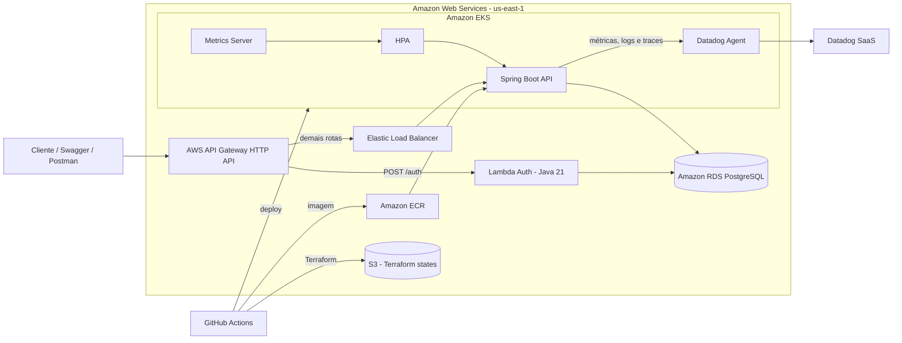
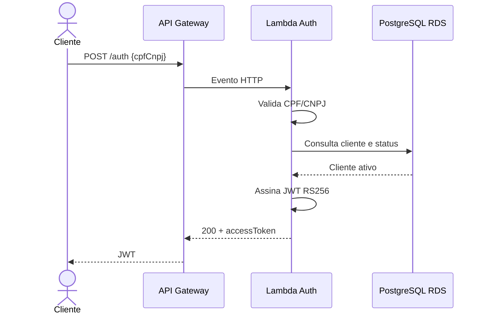
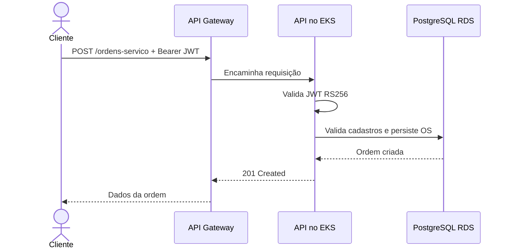
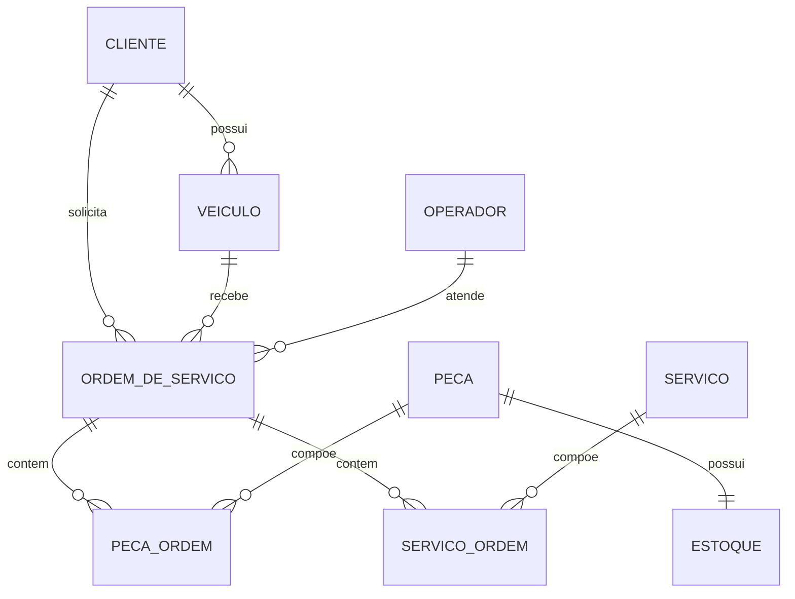

# Arquitetura da Fase 3

## Visão de componentes

O API Gateway é o ponto de entrada. A Lambda valida CPF/CNPJ, consulta o cliente no RDS e assina um JWT com a chave privada RSA. A aplicação conhece somente a chave pública e valida assinatura, emissor e expiração. O banco é externo ao EKS e suas migrations são executadas pelo Flyway.

## Sequência de autenticação

## Sequência de abertura de ordem

## Modelo relacional

O PostgreSQL foi escolhido por oferecer transações ACID, integridade referencial, índices e bom suporte no RDS. As tabelas associativas preservam quantidade, preço cobrado e datas da execução, evitando que alterações futuras no catálogo modifiquem o histórico da ordem. A justificativa formal, as cardinalidades e os ajustes realizados estão em [relational-model.md](relational-model.md).

Os artefatos editáveis de descoberta que originaram esses fluxos estão em [domain/](domain/README.md).

## Observabilidade

- Spring Boot Actuator fornece healthchecks e métricas HTTP/JVM.
- `/actuator/prometheus` expõe métricas para coleta pelo Datadog OpenMetrics.
- Logs são emitidos em JSON e possuem `correlationId` recebido ou gerado por requisição.
- O tracer Java é injetado pelo Datadog Admission Controller e correlaciona
  spans HTTP/JDBC com os logs.
- O HPA utiliza CPU e memória para escalar os pods.
- Dashboards e alertas do Datadog devem cobrir latência, uptime, recursos do Kubernetes, erros de integração, volume de ordens e duração dos status.
