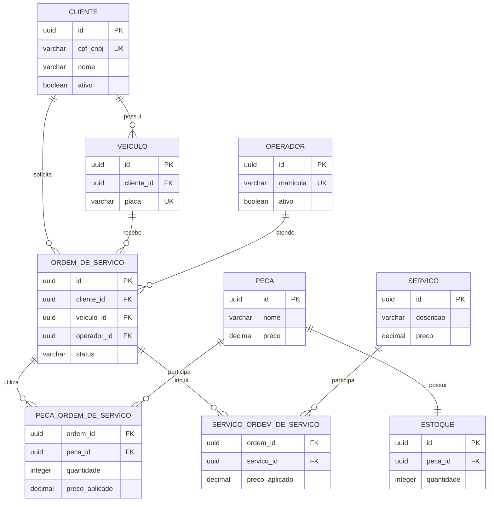

# Modelo relacional e escolha do banco de dados

## Decisão pelo PostgreSQL gerenciado

O PostgreSQL foi escolhido porque o domínio de uma oficina possui dados
fortemente relacionados e operações que precisam ser atômicas. Criar uma ordem,
associar serviços e peças, atualizar estoque e avançar o status não pode deixar
o banco em um estado parcialmente gravado. Transações ACID, chaves estrangeiras,
restrições de unicidade e índices fornecem essas garantias.

O Amazon RDS atende ao requisito de banco gerenciado e transfere para a AWS as
tarefas de provisionamento, backups, aplicação de patches e monitoramento da
instância. O PostgreSQL também é compatível com JPA/Hibernate, Flyway, JDBC na
Lambda e o modelo já utilizado nas fases anteriores.

## Diagrama entidade-relacionamento

## Relacionamentos e cardinalidades

- **Cliente 1:N Veículo:** um cliente pode possuir vários veículos; cada
  veículo pertence a um cliente.
- **Cliente 1:N Ordem de Serviço:** preserva quem solicitou a ordem, mesmo que o
  veículo seja consultado separadamente.
- **Veículo 1:N Ordem de Serviço:** um veículo pode retornar à oficina diversas
  vezes; uma ordem trata apenas um veículo.
- **Operador 1:N Ordem de Serviço:** registra o responsável pelo atendimento e
  exige matrícula ativa na abertura.
- **Ordem N:N Peça:** materializado por `PECA_ORDEM_DE_SERVICO`, que registra
  quantidade e preço aplicado sem modificar o histórico quando o catálogo muda.
- **Ordem N:N Serviço:** materializado por `SERVICO_ORDEM_DE_SERVICO`, que
  registra os serviços e o valor considerado no orçamento.
- **Peça 1:1 Estoque:** cada peça possui um saldo controlado e versionado para
  evitar atualização concorrente perdida.

## Ajustes realizados na Fase 3

- O documento do cliente foi consolidado em `cpf_cnpj`, aceitando pessoa física
  ou jurídica e mantendo unicidade.
- UUID passou a ser a identidade interna usada no `sub` do JWT; documentos não
  são expostos no token.
- O banco saiu do Kubernetes e passou para um RDS privado e criptografado.
- Flyway passou a controlar criação do esquema e dados de demonstração.
- A aplicação usa `ddl-auto=validate`: o Hibernate verifica o esquema, mas não
  o altera automaticamente.
- Tabelas associativas preservam quantidade e preço histórico da ordem.
- Exclusão lógica é representada por `ativo` e `data_inativacao` quando
  aplicável, evitando perda de histórico.

## Integridade e evolução

As foreign keys impedem referências a entidades inexistentes. Chaves únicas
protegem CPF/CNPJ, placa e matrícula. Alterações futuras devem ser adicionadas
como novas migrations `V<n>__descricao.sql`; migrations já aplicadas não devem
ser editadas, pois o Flyway valida seus checksums.
